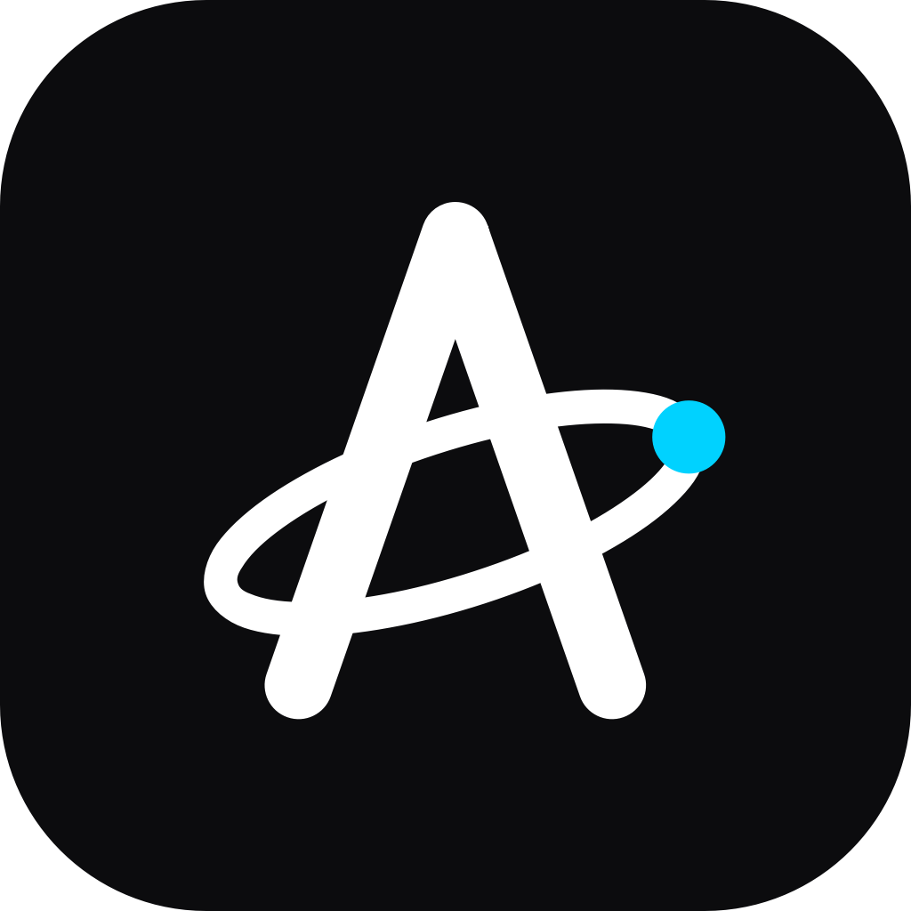

<p align="center">
  
</p>

<h1 align="center">Aura</h1>
<p align="center">
  <strong>Your pipeline. Revitalized.</strong><br>
  An autonomous fleet of AI agents that finds leads, qualifies them, and writes outreach that lands, running entirely on your own machine.
</p>

<p align="center">
  <a href="https://github.com/Etriti00/aura-app/stargazers"></a>
  <a href="https://github.com/Etriti00/aura-app/issues"></a>
  <a href="https://github.com/Etriti00/aura-app/blob/main/LICENSE"></a>
  <a href="https://github.com/Etriti00/aura-app/actions/workflows/tests.yml"></a>
</p>

<p align="center">
  <a href="#quick-start">Quick Start</a> ·
  <a href="#the-multi-agent-framework">Architecture</a> ·
  <a href="#the-model-fleet">Model Fleet</a> ·
  <a href="DOCUMENTATION.md">Technical Docs</a> ·
  <a href="USER_MANUAL.md">User Manual</a>
</p>

## What is Aura

Aura is a desktop AI sales platform that automates the complete B2B pipeline, from discovering prospects to closing deals. A coordinated swarm of twenty specialized agents handles prospecting, research, qualification, outreach, follow up, invoicing, and voice calls. Everything runs on your machine: your data lives in a local SQLite database, your API keys are sealed with machine bound AES 256 encryption, and every consequential action can be gated behind your approval.

The pipeline in one line: find leads, enrich and qualify them, research the promising ones, draft personalized emails, send sequences, detect replies, classify intent, handle objections, follow up, and close. Each step is automated, each step is configurable, and each step asks permission until you decide otherwise.

## The Multi Agent Framework

Aura is built as a hierarchical agent swarm rather than a single chatbot.

**Coordination model.** A Commander agent sits at the top of a rank based hierarchy of orchestrators, specialists, and workers. Incoming work is triaged into typed tasks (over 25 task types) and dispatched to the agent whose role, skills, and playbook match. Agents share a kanban ticket system with escalation paths, dependencies, and due dates, so long running work stays visible and auditable. Reflection scoring and a self improvement loop let agents learn from outcomes, while a correction memory captures your feedback and injects the learned rules into future agent context.

**Model selection for every agent.** Each agent in the swarm can run on its own model. Every agent carries a tier (local, ollama, haiku, or sonnet) that feeds the four tier cost router, and optionally an explicit model override that pins the agent to one exact model from the fleet. A research agent can run `xai/grok-4.5` while the drafting agent runs `anthropic/claude-sonnet-5` and a classifier runs a free local `ollama/llama3.1`. Overrides are set in the Fleet page agent dialog or through the CLI.

**Strict two step verification.** No model assignment is finalized until it passes verification. Step one confirms the provider authenticates, meaning the key or subscription is present and accepted. Step two sends a live test prompt and requires a real response from the model. Only then is the assignment saved. The same check is available anytime via `/model-verify <model_id>`.

**Cost governance.** The router selects the cheapest capable tier per task, budget pacing downgrades tiers as daily spend approaches your limit, and per model usage is tracked for reporting.

## The Model Fleet

Aura ships with first class support for a wide fleet, and any model LiteLLM can reach will work. Configure keys in Settings, or use one OpenRouter key for the entire fleet.

* **Anthropic**: `anthropic/claude-fable-5`, `anthropic/claude-opus-4-8`, `anthropic/claude-sonnet-5`, `anthropic/claude-haiku-4-5`
* **OpenAI**: `openai/gpt-5.5`, `openai/gpt-5.2`, `openai/gpt-4.1`
* **Google**: `gemini/gemini-3.5-flash`, `gemini/gemini-3-flash`, `gemini/gemini-3.1-flash-lite`
* **xAI**: `xai/grok-4.5`, `xai/grok-4.3`
* **Z.ai**: `zai/glm-5.2`, `zai/glm-5.1`
* **Moonshot**: `moonshot/kimi-k2.7`, `moonshot/kimi-k2.6`
* **Alibaba**: `dashscope/qwen3-max`
* **MiniMax**: `minimax/minimax-m3`, `minimax/minimax-m2.5`
* **NVIDIA NIM**: `nvidia_nim/nvidia/nemotron-3-ultra-550b`
* **OpenRouter**: one key routes to all of the above plus `openrouter/auto`
* **Ollama**: any local model, private and free

**Custom models.** Register any additional model IDs with `/config-set custom_models "provider/model-a, provider/model-b"` and they appear in every picker. All model dropdowns also accept free typed IDs.

**Subscriptions instead of API keys.** Aura can run on the subscriptions you already pay for by routing calls through official provider CLIs: Claude Pro or Max via the `claude` CLI, ChatGPT Plus or Pro via the `codex` CLI, and a Google account via the `gemini` CLI. Enable these in Settings under Subscription Auth.

## Quick Start

Install the CLI:

```bash
git clone https://github.com/Etriti00/aura-app.git
cd aura-app
pip install .
playwright install chromium
```

The `aura` command is then available globally:

```bash
$ aura status
$ aura hunt "plumber" --city "Austin TX"
$ aura models
$ aura                    # interactive REPL
```

Install the desktop app (GUI):

```bash
pip install ".[gui]"
aura-gui
```

Or install a prebuilt build from the [Releases page](https://github.com/Etriti00/aura-app/releases/latest). Every release ships a guided installer per platform:

* **Windows** — `AuraSetup.exe`, a standard install wizard with Start Menu and desktop shortcuts and an uninstaller.
* **macOS** — a native build per chip, drag Aura into Applications. Pick `Aura-macOS-AppleSilicon.dmg` on an M1 or newer, or `Aura-macOS-Intel.dmg` on an Intel Mac (Apple menu → About This Mac tells you which). macOS 13 or later.
* **Linux desktop** — `Aura-Linux-Installer.run`, a self extracting installer (system wide with `sudo`, otherwise per user).
* **Raspberry Pi and VPS servers** — headless CLI builds (`Aura-RaspberryPi-arm64.tar.gz`, `Aura-Server-Linux-x64.tar.gz`). Install either in one line:

  ```bash
  curl -fsSL https://raw.githubusercontent.com/Etriti00/aura-app/main/installers/server/install.sh | bash
  ```

The landing page detects your operating system and offers the right build. macOS is the one exception: browsers report Apple Silicon Macs as `MacIntel`, so both Mac builds are offered side by side rather than guessed at.

**First launch on macOS.** Aura is not yet signed with an Apple Developer ID, so macOS quarantines it after download and may refuse to open it — either "Aura is damaged and can't be opened" or "Apple could not verify Aura is free of malware". Clear the quarantine flag once, after installing or updating:

```bash
xattr -cr /Applications/Aura.app
```

On first launch, configure at least one AI provider (an API key or a subscription CLI), your sender identity, and email delivery. All keys are encrypted with a per install salt and never leave your device.

## Features

**Lead discovery and enrichment.** Multi source scraping (DuckDuckGo, Google Maps, Yelp), API integrations (Apollo.io, Hunter.io, HubSpot), CSV imports including LinkedIn exports, a waterfall enrichment pipeline spanning DNS, a local LLM, free APIs, and deep crawling, plus LLM powered qualification with scoring. A campaign manager provides per campaign drill down, one click enrichment, and CSV export.

**Deep research.** Tavily, Firecrawl, and Apify providers with LLM synthesis into company overviews, pain points, tech stack, and opportunity gaps. Research depth adapts to lead score.

**Outreach automation.** Research grounded email drafts, multi step follow up sequences, IMAP reply detection with intent classification, a conversation engine for multi turn threads, and A/B testing of subject lines and variants.

**Chat copilot.** A frosted glass chat panel with a model selector in its header, file attachments inlined into context, stop generation, streamed responses, and natural language commands.

**Voice calling as a last resort.** Twilio WebSocket media streams, a TTS cascade (ElevenLabs, then OpenAI, then local Piper), Whisper STT, stalled lead detection, and mandatory approval before any call.

**Autonomy and control.** Four autonomy levels from Observer to Full Trust, an approval queue for sensitive actions, daily budget limits with automatic tier downgrade, and per provider rate limiting.

**Integrations.** Telegram and Discord bots with slash commands and notification channels, HubSpot and Pipedrive CRM sync, a command palette on Ctrl+K, and cross page deep links.

**Analytics.** A live dashboard with funnel visualization, Google Trends market intelligence, per model cost breakdowns, and a full command audit trail.

## Interface

The desktop app is an Apple style liquid glass interface: a near black base with genuine desktop blur behind the window — acrylic on Windows 11, native NSVisualEffectView glass with seamless titlebar chrome on macOS, and KWin blur-behind on KDE Plasma — plus capsule buttons, macOS style pop up selectors, and monochrome SF style iconography across all fourteen pages, the sidebar, dialogs, tables, and the chat panel. The CLI mirrors full feature parity with 82 commands across 17 groups plus a natural language REPL, and runs headless on servers and Raspberry Pi.

## Architecture

```
Interface layer     GUI (PySide6, 14 pages) and CLI (REPL, 82 commands)
Controller layer    18 QObject controllers with signal and slot wiring
Engine layer        50+ specialized engines (business logic)
Data layer          SQLAlchemy ORM on SQLite in WAL mode
External services   LiteLLM fleet, Apollo, Twilio, Telegram, Discord, IMAP
```

Key modules: `core/model_fleet.py` (provider and model registry), `core/model_verifier.py` (two step validation), `core/router_engine.py` (four tier cost routing plus per agent overrides), `core/cli_llm.py` (subscription CLI transport), `core/skill_registry.py` (the skill library and capability matching), `core/agent_engine.py` (per agent skill assignments and the Commander grant flow), `core/fleet_orchestrator.py` (swarm dispatch), and `core/orchestrator_engine.py` (natural language to actions).

## Testing

```bash
venv\Scripts\python.exe -m pytest tests/ -v
```

Current status: 1,384 tests across 56+ files, all passing. Continuous integration runs the suite on every push and, on tagged releases, builds the guided installers for Windows, macOS, and Linux plus headless CLI tarballs for Raspberry Pi (arm64) and VPS servers (x64).

## Changelog

### v2.6.0, Skill Assignments, On Demand Forging, Installers, and a Full Redesign

* **Per agent skills.** Every agent now carries a least privilege set of the skills its duties require. When a task needs a skill an agent does not have, the agent requests it from the Commander (tier one), the grant is logged, and the assignment is widened. When a task needs a skill that does not exist, the Forger designs a new one with an LLM pass (persona, instructions, schemas, sampling) rather than a template stub. Skills are injected into the prompt before routing, so they work on any model, subscription or API or local.
* **Servers and small devices.** A Qt free headless build runs the full agent fleet and the 82 command CLI with no display, shipped for Raspberry Pi (arm64) and VPS servers (x64), plus a Dockerfile.
* **Guided installers.** A real install wizard per platform: Inno Setup on Windows, a drag to Applications DMG on macOS, a self extracting `.run` on Linux, and a one line `curl | bash` for servers.
* **Apple liquid glass redesign.** The entire interface was rebuilt to Apple's Human Interface Guidelines: genuine blur behind the window on Windows 11 (acrylic), macOS (NSVisualEffectView with seamless titlebar chrome), and KDE Plasma (KWin blur-behind), capsule buttons, macOS style pop up selectors, monochrome SF style icons, and a new orbital A logo across the app, taskbar, and dock.
* **New landing page** with a cinematic hero, an interactive product mockup, and auto detecting downloads.

### v2.5.0, Glass UI, Agent Model Fleet, Verified Assignments

* Complete glassmorphism redesign of the entire interface: midnight gradient base, nearly transparent frosted panels, hairline borders, neon purple and yellow accents, larger radii, restyled tables, tabs, inputs, badges, scrollbars, and a fully redesigned chat panel, in both themes
* Model fleet registry with ten providers including xAI Grok, Z.ai GLM, Moonshot Kimi, Alibaba Qwen, MiniMax, and NVIDIA NIM Nemotron, plus custom model registration and editable pickers everywhere
* Per agent model overrides: pin any agent in the swarm to any fleet model from the agent dialog
* Strict two step verification (authenticate, then a live round trip) gates every agent model assignment and is exposed as `/model-verify`; `/models` lists the fleet with key status
* Chat panel header gained a model selector wired to settings
* New provider key fields in Settings and environment injection across the router, orchestrator, and outreach engines

### v2.4.0, Latest Models and Full E2E Hardening

* Claude Fable 5, Opus 4.8, and Sonnet 5, GPT 5.5, and Gemini 3.5 Flash across all pickers with new defaults
* Every CLI command and GUI page exercised end to end against a live sandbox; fixed `/trends-opportunities`, `/ask` under subscription auth, `/unsuppress` input validation, and REPL piped input on Windows

### v2.3.0, ChatGPT Subscription via Codex CLI

* OpenAI models can run on a ChatGPT Plus or Pro subscription through the official Codex CLI; the former OAuth sign in flow could never produce a usable API credential and was removed
* A shared CLI transport consolidates the claude, gemini, and codex subprocess paths; the router became subscription aware
* Fixed dead lead scraping (brotli decoding) and Windows CLI launching (npm shims, long prompts via stdin)

### v2.2.0, Subscription Auth, Chat Upgrades, Campaign Manager

* Subscription auth for Claude and Gemini, chat attachments with stop and streaming, the Hunter campaign manager, natural language lead queries, reliability fixes across background workers, graceful shutdown repairs, and CI with tested releases

### Earlier releases

* v2.1.0 added correction memory, the knowledge base, per agent auto memory, and audit fixes
* v2.0.0 added multi platform response formatting, the four layer enrichment pipeline, Excel export, pricing and invoicing with an Accountant agent, Discord server mode, Telegram commands, and the tabbed Settings page
* The v1.x line built the pipeline, the 20 agent fleet, two hardening rounds, the advanced CLI, and cross platform packaging

## License

Distributed under the MIT License. See `LICENSE` for details.

<p align="center">
  Built with <a href="https://www.python.org/">Python</a> and a fleet of AI agents.<br>
  <sub>Aura v2.5.0</sub>
</p>